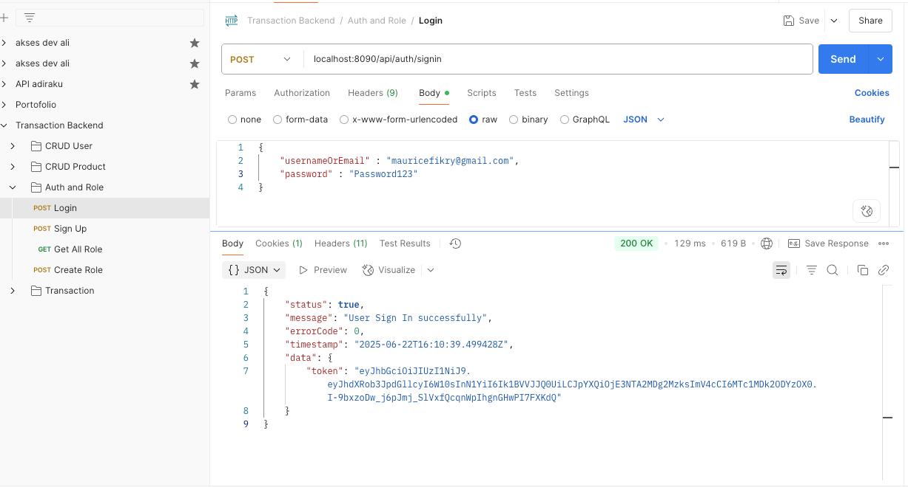
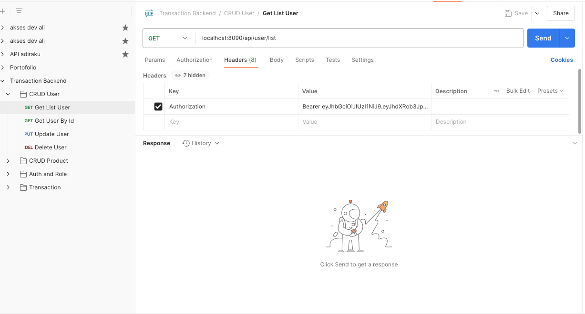
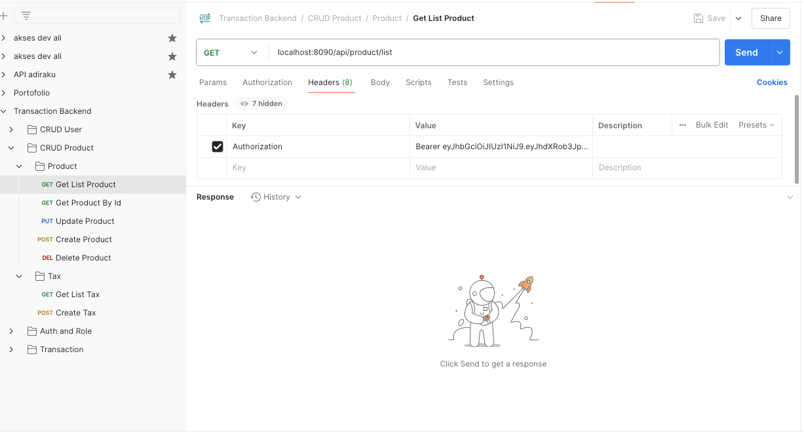
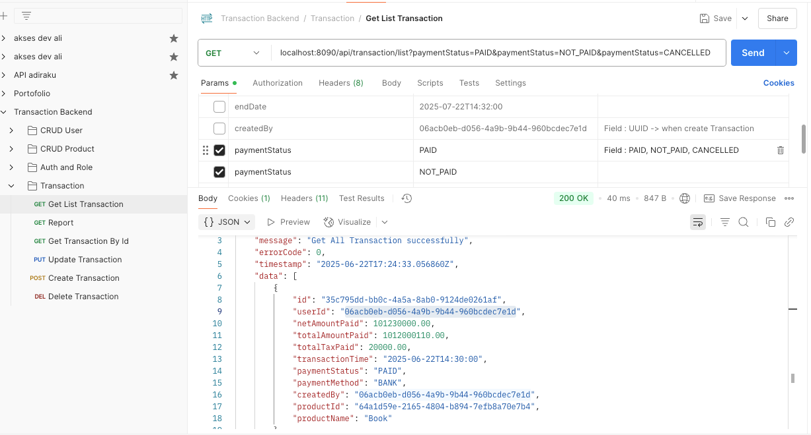
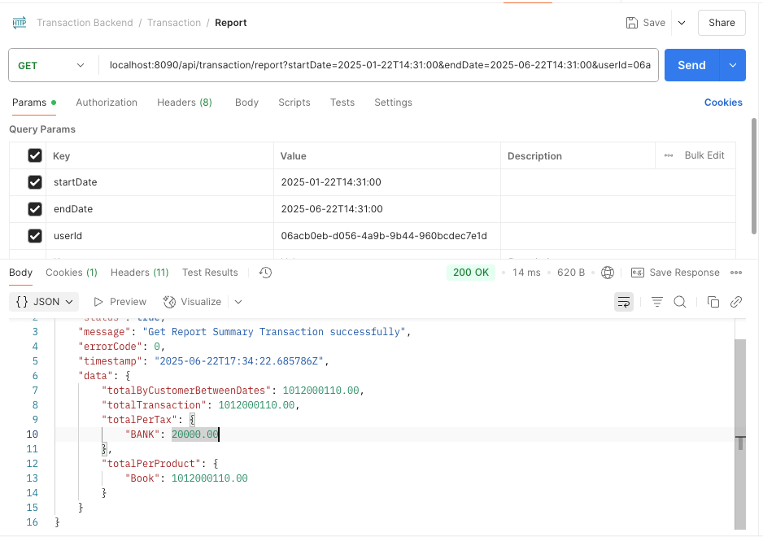

# Transaction Backend Service

Transaction Backend Service built using Sprint Boot 4.0.0-RELEASE and Java 24

# Technology Stacks

- Java 24
- Spring 4.0.0-RELEASE
- PostgreSQL Database
- Hibernate Library using JPA
- Postman
- Model View Controller

# Postman

- Auth Endpoint and Create ROLE

- CRUD User Endpoint

- CRUD Product Endpoint

- CRUD Transaction Endpoint

- Endpoint report

